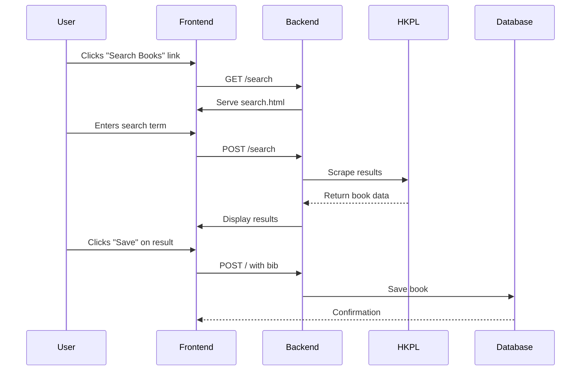

# HKPL Tools Search Feature Implementation Plan

## Overview
Implement a dedicated search page for book lookup functionality while maintaining existing save workflow.



## Implementation Details

### 1. New Template (search.html)
```html
<!-- templates/search.html -->



  <form action="/search" method="post">
    <input type="text" name="search_term" 
           placeholder="Enter book title or author"
           value="{{ search_term }}">
    <button type="submit">Search</button>
  </form>

  
  <div class="search-results">
    
    <div class="result-item">
      <h3>{{ book.title }}</h3>
      <p>Publication: {{ book.publication }}</p>
      <form action="/" method="POST">
        <input type="hidden" name="bib" value="{{ book.id }}">
        <button type="submit">Save Book</button>
      </form>
    </div>
    
  </div>
  

```

### 2. Route Addition (app.py)
```python
@app.route("/search", methods=['GET', 'POST'])
def search_books():
    if request.method == 'POST':
        search_term = request.form.get('search_term')
        results = get_book_list(search_term)
        return render_template('search.html',
                            results=results,
                            search_term=search_term,
                            libraries=libraries)
    return render_template('search.html', libraries=libraries)
```

### 3. Navigation Update
```html
<!-- In templates/index.html -->
<div style="margin: 20px 0;">
  <a href="/">Home</a> | 
  <a href="/search">Search Books</a> | 
  <a href="/Saved_Books">Saved Books</a>
</div>
```

## Validation Checklist
- [ ] Search page maintains consistent styling
- [ ] Error handling for empty/invalid searches
- [ ] Mobile-responsive layout
- [ ] Proper navigation between pages
- [ ] Existing save functionality unaffected

## Next Steps
1. Create search.html template
2. Implement /search route
3. Update navigation links
4. Test search/save integration