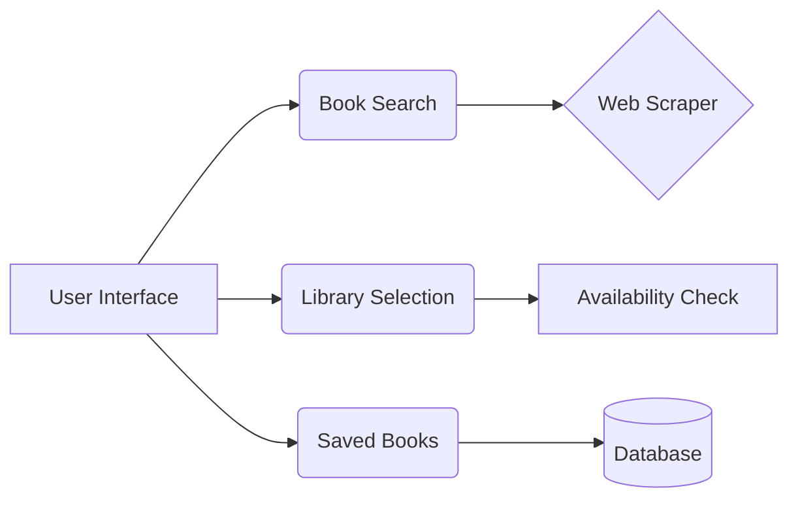

# HKPL Book Management System Documentation

## System Overview
Web-based tool for managing Hong Kong Public Library book availability across branches. Provides real-time updates and historical tracking of book copies.

## Key Features


## Setup Guide
1. **Prerequisites**:
   - Python 3.8+
   - `pip install -r requirements.txt`

2. **Initialization**:
   ```bash
   python "create empty database.py"
   flask run
   ```

## Usage Guide
### Book Search
1. Enter either:
   - HKPL Bib ID (e.g. `3655993`)
   - Full book URL from HKPL website
2. View real-time availability across libraries

### Library Management
1. Select library branch from dropdown
2. System displays:
   - Available copies
   - Last update timestamp
   - Collection location

## Troubleshooting
| Error Message | Solution |
|---------------|----------|
| "Update failed" | Retry during off-peak hours |
| "Invalid Bib ID" | Verify ID format: 7-digit number |
| Scraping errors | Check HKPL website status |

## FAQ
**Q: How often is availability updated?**  
A: Manual updates via "Update Copies" button

**Q: Data storage location?**  
A: SQLite database (`hkpl_tools.db`)