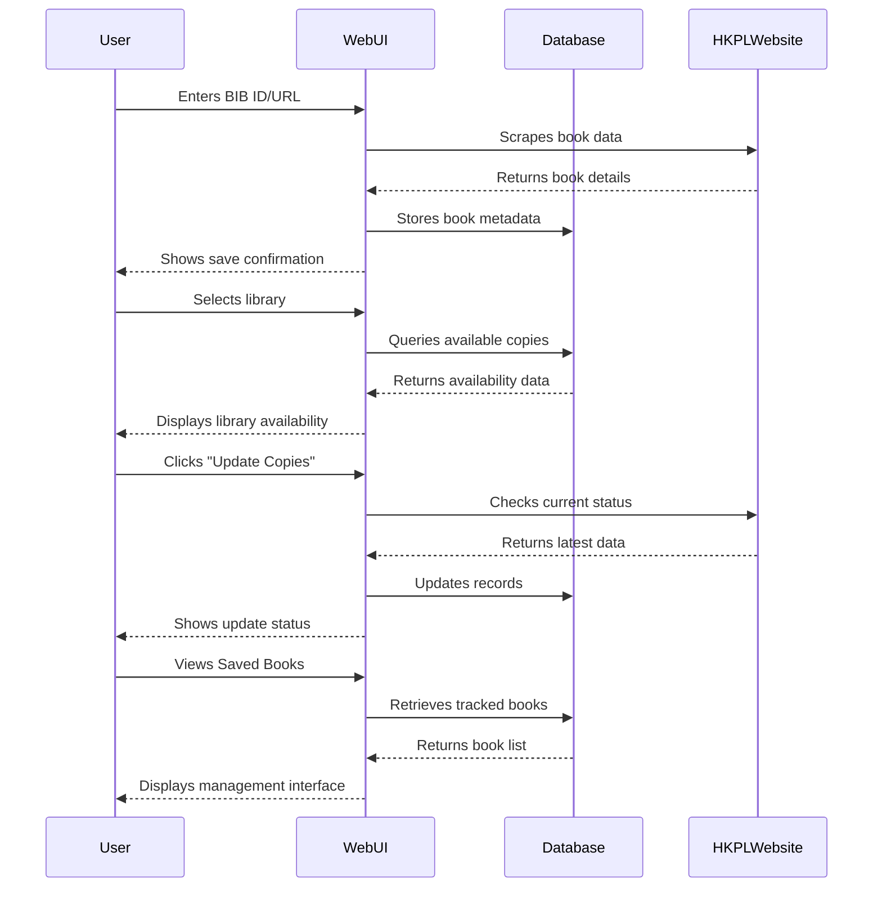

# HKPL Tools User Guide

## Application Workflow



## Core Features

### 1. Book Tracking
- **Supported Inputs**:
  - Direct BIB numbers (e.g. 147569)
  - HKPL website URLs
- **Data Processing**:
  - Automatic URL parsing
  - Real-time availability checks
  - Multi-library support

### 2. Availability Monitoring
- **Library Selection**:
  - Dropdown with 20+ branches
  - Last update timestamp
- **Display Format**:
  ```html
  <table>
    <tr>
      <th>Title</th><th>Call No.</th>
      <th>Status</th><th>Collection</th>
    </tr>
    <!-- Dynamic rows -->
  </table>
  ```

### 3. Data Management
- **Update System**:
  - Manual trigger via UI
  - Batch processing
  - Error reporting
- **Book Management**:
  - Bulk delete interface
  - Soft delete (planned)
  - Version history (planned)